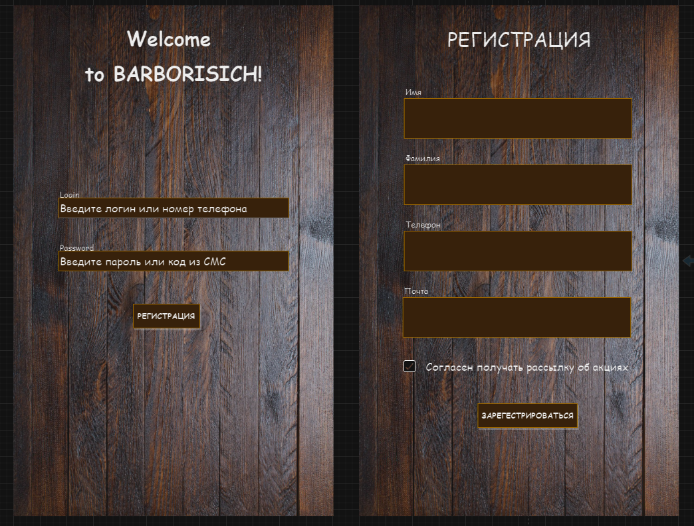
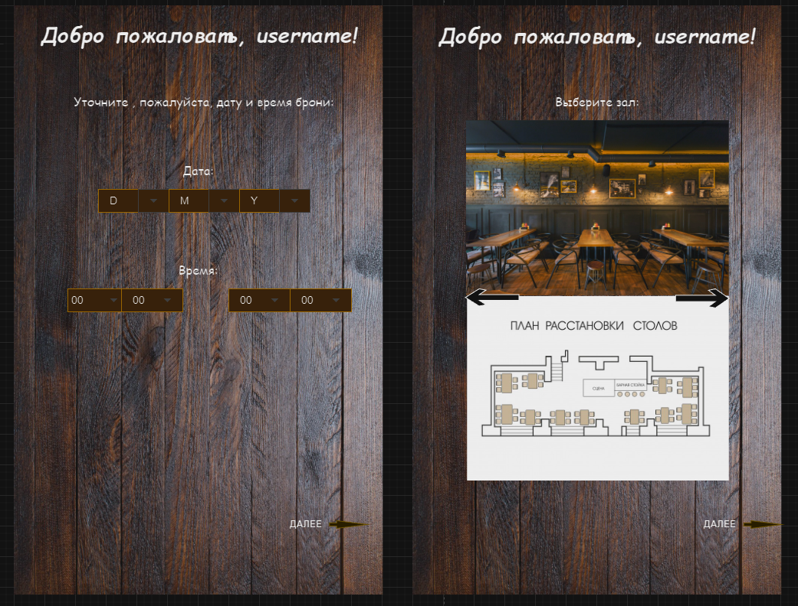
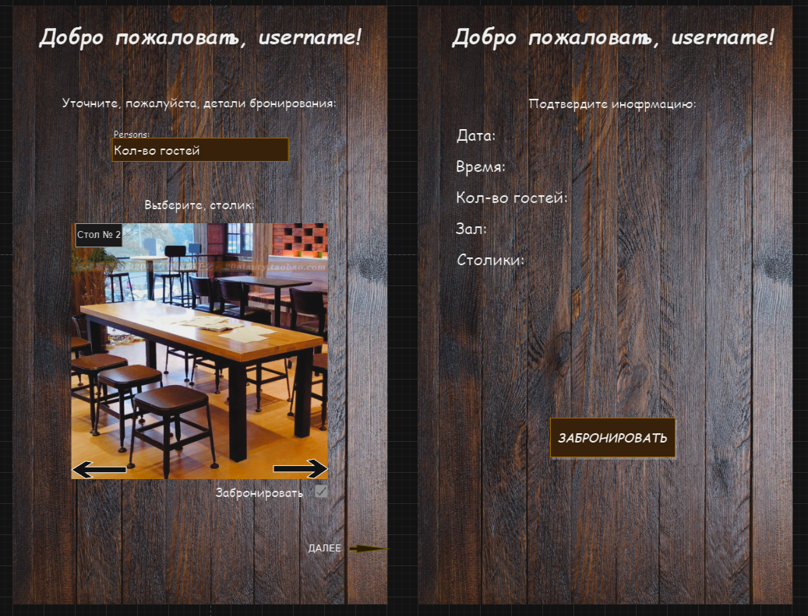
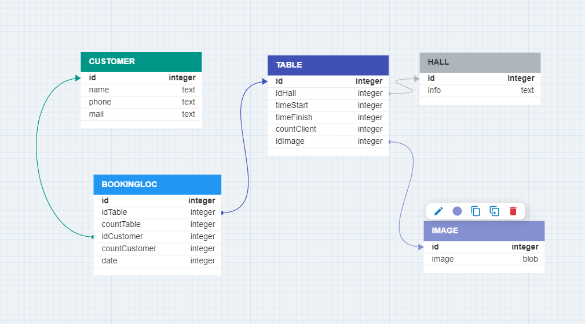
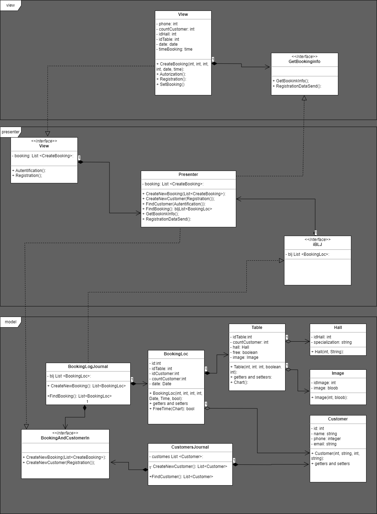

> **Урок 8. Типы архитектур прикладных приложений (мобильные): MVC, MVP, MVVM.**

> **Домашнее задание:** Разработать экранные формы интерфейса, разработать полную ERD домена, разработать UML - диаграмму MVP - паттерна.

> Экранная форма:

> ERD - диаграмма:

> UML:

